# Store Website

## Poject Desrciption:

Fruits Store Website is a single page Application made of using Javascript's very popular library React-js with TypeScript using Material-UI. It have a Navbar at the top of application which have links to route on different pages(you can route on Home, About, Store). it contains clickable Add to cart buttons , and having many products to explore. In this project mainly focused on Typescript and Shopping cart using Redux.
Shopping carts are one of the most common things to build as a web developer, but there is a lot that goes into building a good shopping cart. In this project I had mentioned how to build a fully functional shopping cart using React, TypeScript, and Material-UI. This is a great intermediate level project.

## Technology Used:
- React JS : React JS is a Javascript library used to develop the application.
- TypeScript : TypeScript is a syntactic superset of JavaScript which adds static typing. This basically means that TypeScript adds syntax on top of JavaScript, allowing developers to add types.TypeScript allows specifying the types of data being passed around within the code, and has the ability to report errors when the types don't match.
- Material-UI : Some Material-UI components like Icons, Grid, Badge, Typography , MakeStyle, Button, Styled is Used.
- Javascript :
- JSX : Javascript XML is used to structure the page.
- Material CSS : MUI makestyle is used to style the page and make it more beutiful and attractive.
- Basic CSS: used to provide basic comfortability to website.
- Redux:  It allows React components to read data from a Redux Store, and dispatch Actions to the Store to update data.
- React-Toastify: This tool allows you to add toast notifications to your application with ease and can also be used to set notifications and alerts.

## What I've Learnt :

- About some material-UI components and how to used them.
- Setup of  React-js with TYpeScript and material-UI installation.
- Setup ES Lint and identifying its error and resolving them.
- writing clean and structure code.
- How to use props.
- implementation of Map function.
- React Routing with link , path etc.
- how to use useState, UseEffect, onClick event handling,etc.
- how to add Typescript Syntax.
- how to use redux in project, by increasing counter value and updating data.
- how to use toastify notification for any update.

## Getting Started with Create React App

This project was bootstrapped with [Create React App](https://github.com/facebook/create-react-app).

### `npm start`
 open project enter in shopping-cart folder and run command "npm start"
 like this:-
 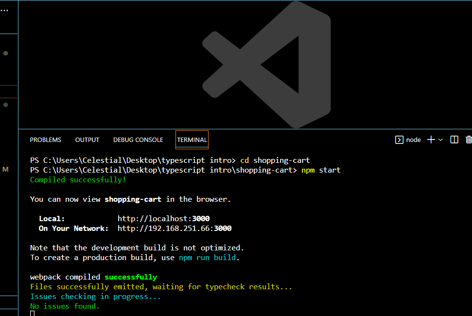

The page will reload if you make edits.\
You will also see any lint errors in the console.

### Home - Page

Home Screen -  Header
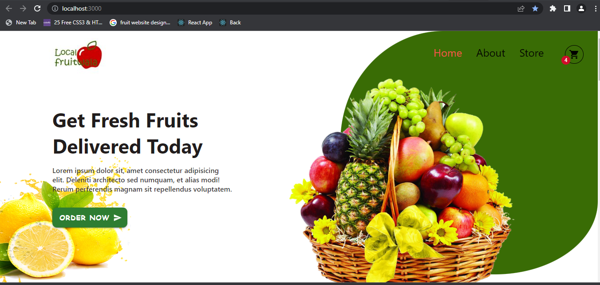
- This is main home page footer part. if click on odernow button it will redirect to store page.

BuyNow- Section
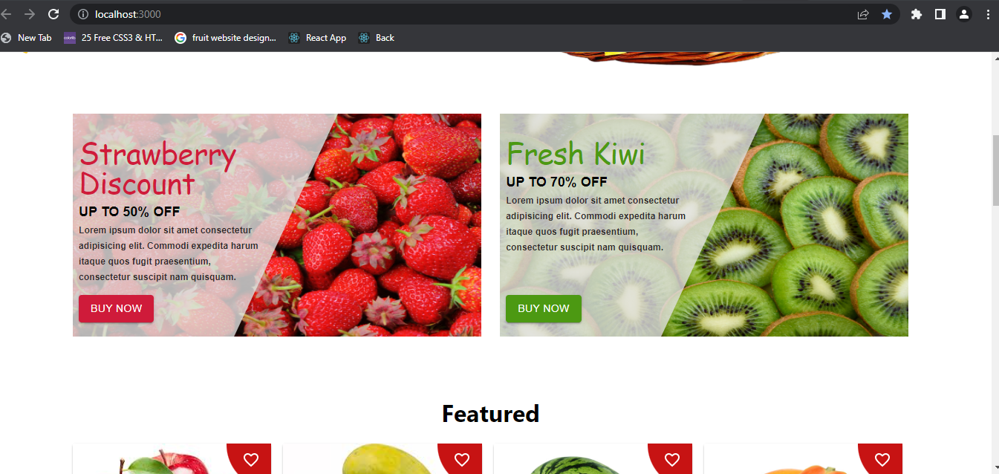
- This is main home page BUY now part.

Fetured- Section
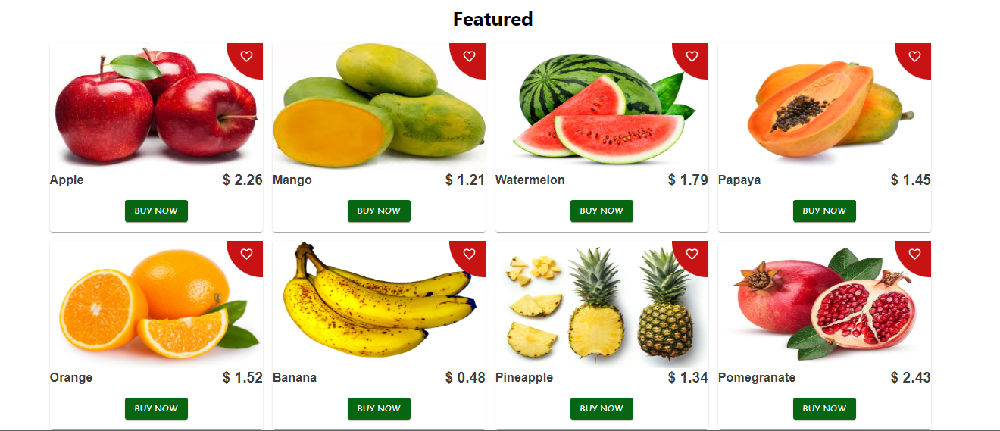
- This is main home page Fetured part.

Shop Now - Section
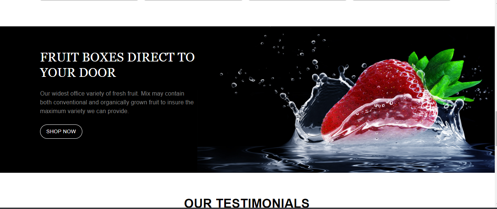
- This is main home page shop Now section. if click on Shop now button it will redirect to store page.

Testimonial - Section
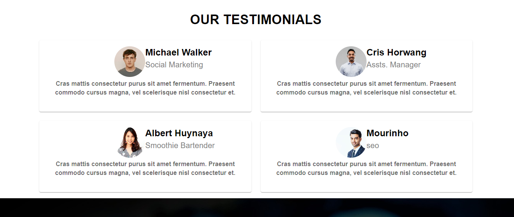
- This is main home page Testimonials part.

-Footer - Section
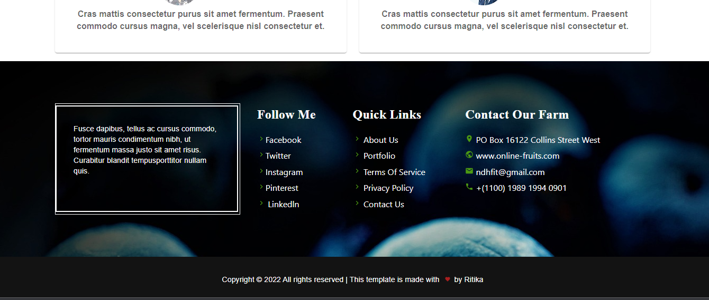
- This is main home page Testimonials part.

### About- us - Page

About Screen - Header
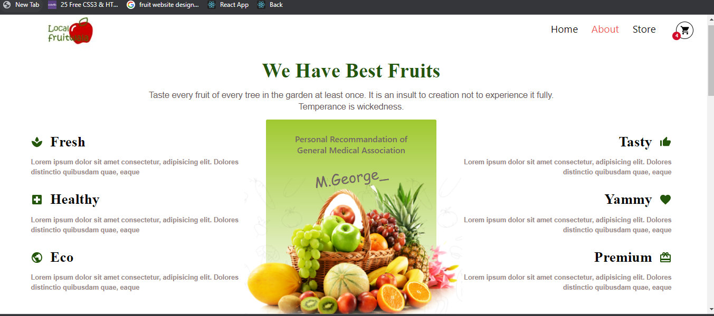
- This is About-us page Header part.

Know us- Section
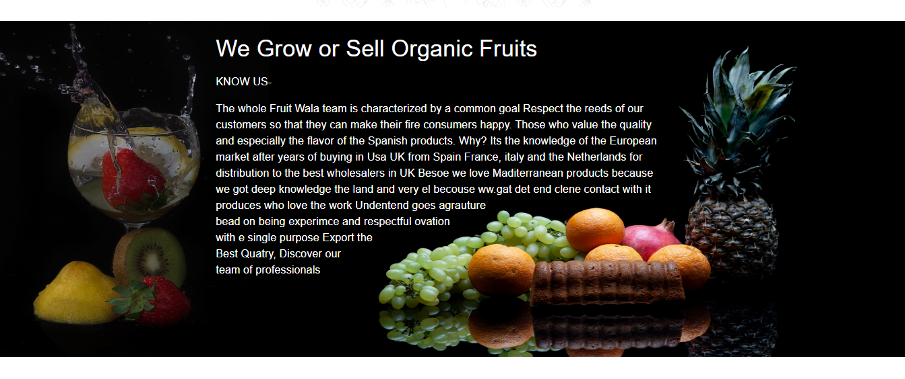
- This is Aboutus page Know-us part.

Meet Our Team- Section
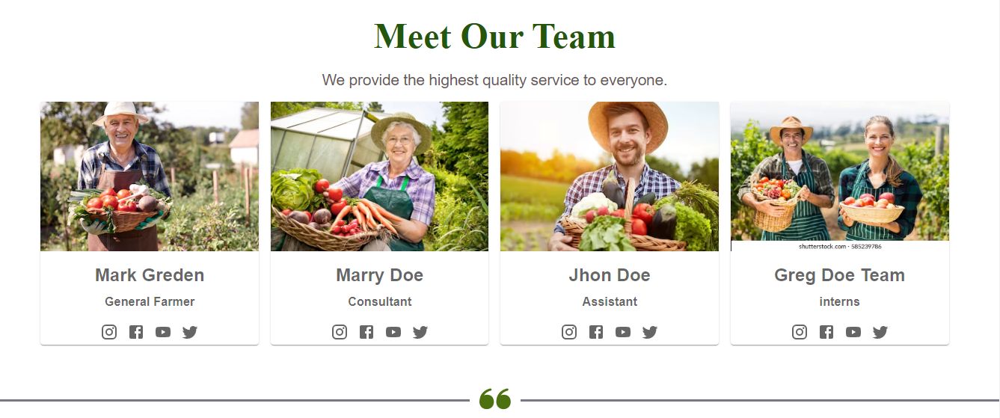
- This is Aboutus page Meet our Team part.

Our Client - Section
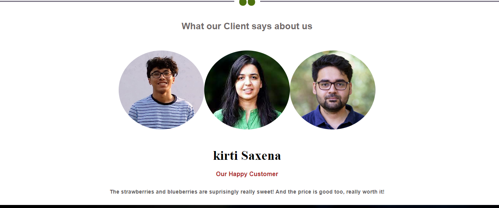
- This is Aboutus page Our Client.
- click on any image of client user are able to see review of that client.

Footer - Section
.

### Store - Page
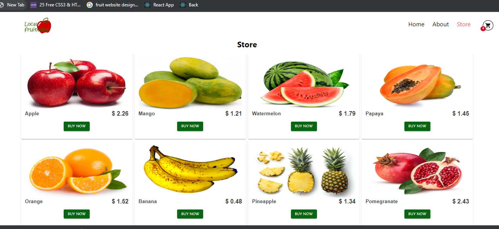
- This is Store page here user can shop by clixking on buy now button it will redirect to Add to cart page.

### Product Details - Page
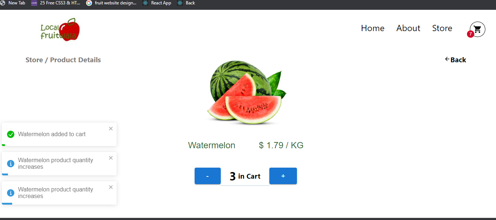
- This is Product Detail page here user can Add or decrement the number of products. and notification also come whenever user increment and decrement now item is added in cart.

### Cart - Page
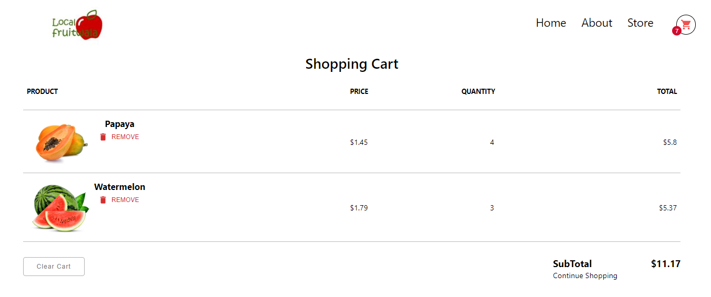
- This is product Cart page here user see there added items with price,quantity, total price, and total cost price of all items user can delete or remove some products by clicking on delete button.  and also a clear button it clear the cart item and notification also come whenever detele button or clear button is cxlicked. data diplayed in cart item page from local storage so that if page refresh last data not goint to be lost.

## Available Scripts

In the project directory, you can run:

